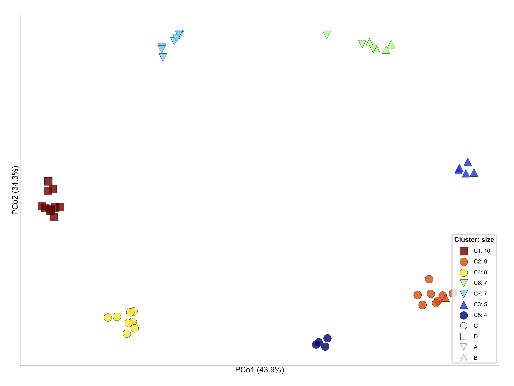
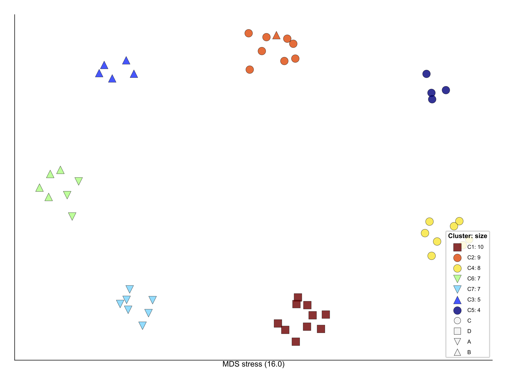

# m2clust: multi-resolution clustering of omics data #

**m2clust** is a clustering method that detects
clusters of features using omics data and scores metadata 
(resolution score) based on their influences in clustering.
The similarity of features within each cluster can be 
different (different resolution). Resolution of similarity score takes to 
account not only similarity between measurements and 
also the structure in a hierarchical structure of data and 
number of features which group together.

---

**Citation:**

Rahnavard A. et al, *m2clust: multi-resolution clustering of omics data*

----

* Please see the [Wiki/Workshop](https://github.com/omicsEye/m2clust/wiki/Workshop) for a one hour workshop.

----
# mclust user manual
----
mclust: multi-resolution clustering of omics data
 * For additional information and a quick demo, please see the [mclust tutorial](https://github.com/omicsEye/m2clust/).

---
<!---
**Citation:**
Rahnavard A etal. **mclust: multi-resolution clustering of omics data**. https://github.com/omicsEye/m2clust/
--->

---  	

----
### Quick start ###

* Installation

*m2clust* is implemented in python and packaged and available
via PyPi. Run the following command to get it installed (use `sudo`
to install it for all users or use --user and provide a path with write access) 

``
$ sudo pip3 install m2clust
`` 
* Input data 

The input data is a distance matrix of feature `n*n` 
where `n` is the number of features.
optional input is a metadata table `n*m` where 
`n` is the number of features and `m` is the number of metadata

* How to run?

``
$ m2clust -i synthetic_demo/adist.txt -o demo_output
``

if metadata is available then use the following command:

``
$ m2clust -i synthetic_demo/adist.txt -o demo_output --metadata synthetic_demo/metadata.txt  --plot
``

`--plot` is optional to generate a heatmap with 
deprogram of the data 

`--metadata` is optional to shape the clusters with 
highest influence in clusters.


* output
1. `m2clust.txt` contains cluster, their members,
and metadata resolution score sorted 
from highest to lowest score.

* [Learn more about details of options](https://github.com/omicsEye/m2clust/wiki)

### Demo run using synthetic data ###
1. Download the input:
[Distance matrix](m2clust_demo/synthetic_data/adist.txt) and
[metadata](m2clust_demo/synthetic_data/metadata.txt))
2. Run m2clust in command line with input
``$ m2clust -i synthetic_demo/adist.txt -o demo_output --metadata synthetic_demo/metadata.txt --plot``
3. Check your output folder

Here we show the PCoA and DMS plot as one the representative 
visualization of the results. 




### Real world example ###

Please see the wiki for real-world example including: 
gene expression, microbial species stains, and metabolite profiles.


Please see the [Wiki](https://github.com/omicsEye/m2clust/wiki) for the data, their description.


### Support ###

* Please submit your questions or issues with the software at [Issues tracker](https://github.com/omicsEye/m2clust/issues).

## Contents ##
* [mclust](#markdown-header-mclust)
    * [mclust approach](#mclust-approach)
    * [Requirements](#requirements)
    * [Installation](#installation)
* [Getting Started with mclust](#getting-started-with-mclust)
    * [Test mclust](#test-mclust)
    * [Options](#options) 
    * [Input](#input)
    * [Output](#output)  
* [Guides to mclustviz for visuzlaization](#markdown-header-guides-to-m2clustviz-for-visualiazation)


------------------------------------------------------------------------------------------------------------------------------
# mclust #
## mclust appraoch ##

## REQUIREMENTS ##
* [Matplotlib](http://matplotlib.org/)
* [Python 3.*](https://www.python.org/download/releases/)
* [Numpy 1.9.*](http://www.numpy.org/)
* [Pandas (version >= 0.18.1)](http://pandas.pydata.org/getpandas.html)

## INSTALLATION ##
```
$ pip install mclust
```
------------------------------------------------------------------------------------------------------------------------------

# Getting Started with mclust #
## TEST mclust ##

To test if mclust is running correctly, you may run the following command in the terminal:

```
#!cmd

mclust_test

```

Which yields:

```
test_create_folders (basic_tests_utilities.TestUtilitiesBasicFunctions) ... ok
test_is_present (basic_tests_utilities.TestUtilitiesBasicFunctions) ... ok

----------------------------------------------------------------------
Ran 2 tests in 1.01s

OK
```

## Options ##

```
#!python
usage: mclust [-h] [-i INPUT] -o OUTPUT [-m SIMILARITY] [--metadata METADATA]
              [-n ESTIMATED_NUMBER_OF_CLUSTERS] [--size-to-plot SIZE_TO_PLOT]
              [-c LINKAGE_METHOD] [--plot] [--resolution {high,medium,low}]
              [-v]

Multi-resolution clustering using hierarchical clustering and Silhouette score.

optional arguments:
  -h, --help            show this help message and exit
  -i INPUT, --input INPUT
                        the input file D*N, Rows: D features and columns: N samples OR 
                        a distance matrix file D*D (rows and columns should be the same and in the same order) 
                         
  -o OUTPUT, --output OUTPUT
                        the output directory
  -m SIMILARITY, --similarity SIMILARITY
                        similarity measurement {default spearman, options: spearman, nmi, ami, dmic, mic, pearson, dcor}
  --metadata METADATA   Rows are features and each column is a metadata
  -n ESTIMATED_NUMBER_OF_CLUSTERS, --estimated_number_of_clusters ESTIMATED_NUMBER_OF_CLUSTERS
                        estimated number of clusters
  --size-to-plot SIZE_TO_PLOT
                        Minimum size of cluster to be plotted
  -c LINKAGE_METHOD, --linkage_method LINKAGE_METHOD
                        linkage clustering method method {default = single, options average, complete
  --plot                dendrogram plus heatmap
  --resolution {high,medium,low}
                        Resolution c .         Low resolution is good when clusters are well-separated clusters.
  -v, --verbose         additional output is printed
```


## Input ##

* ``-i or --input:`` a distance matrix.
* ``--output-folder``: a folder containing all the output files
* ``--resolution``: a resolution to be used for clustering {low or high}

## Output ##

Returns a list of clusters for features.
**an example output coming soon**


# Guides to mclustviz for visuzlaization #


* **Basic usage:** `$  mclustviz $DISTANCE_MATRIX.txt /path-to-mclust-output/mclust.txt --metadata $META_DATA.txt --shapeby $METADATA1 -o /path-to-mclust-output/`
* `$DISTANCE_MATRIX.txt` = an distance matrix that used for clustering 
* `mclust.txt` = an mclust output which assigns features to clusters
* `$META_DATA.txt`: is metadata file which contains metadat for features
* `$META_DATA1`: is a metadata in the metadata file to be used for shaping poins in the ordination plot
* Run with `-h` to see additional command line options

Produces a set of ordination plots for features colored by computational clusters and shaped by metadata.

```
usage: mclustviz [-h] [--metadata METADATA] [--shapeby SHAPEBY] -o OUTPUT
                 [--size-to-plot SIZE_TO_PLOT]
                 adist clusters

mclust visualization script.

positional arguments:
  adist                 the input file D*N, Rows: D features and columns: N samples OR 
                        a distance matrix file D*D (rows and columns should be the same and in the same order) 
                         
  clusters              the input file D*N, Rows: D features and columns: N samples OR 
                        a distance matrix file D*D (rows and columns should be the same and in the same order) 
                         

optional arguments:
  -h, --help            show this help message and exit
  --metadata METADATA   metadata
  --shapeby SHAPEBY     the input file D*N, Rows: D features and columns: N samples OR 
                        a distance matrix file D*D (rows and columns should be the same and in the same order) 
                         
  -o OUTPUT, --output OUTPUT
                        the output directory
  --size-to-plot SIZE_TO_PLOT
                        Minimum size of cluster to be plotted
```


