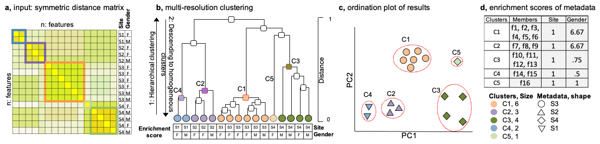
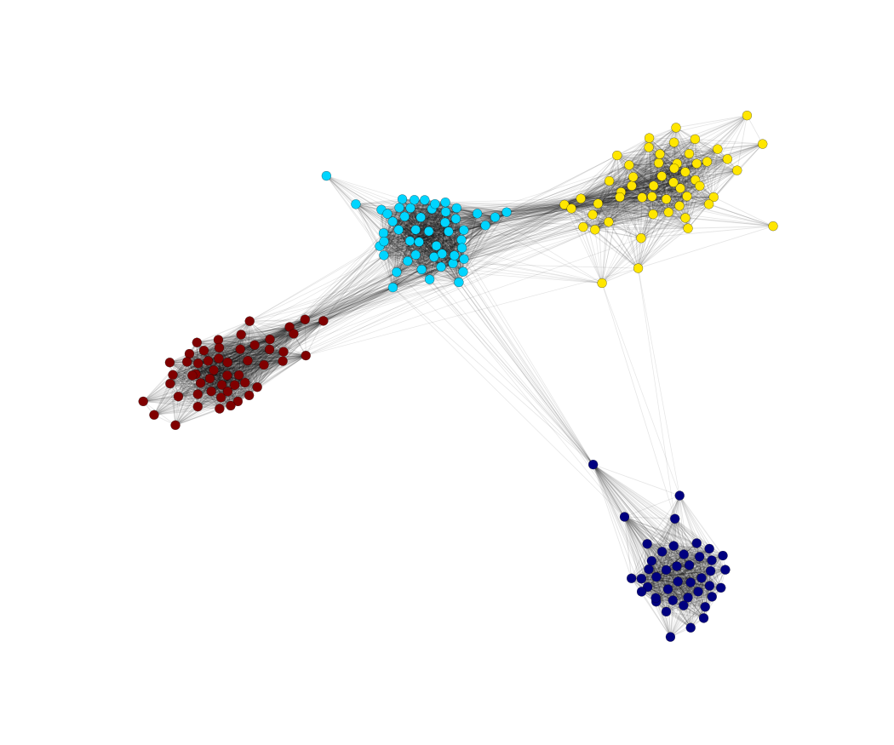
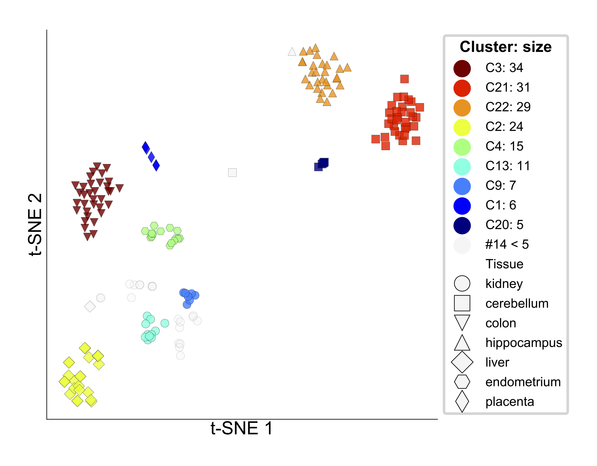

# omeClust: multi-resolution clustering of omics data #

**omeClust** is a clustering method that detects
clusters of features using omics data and scores metadata 
(resolution score) based on their influences in clustering.
The similarity of features within each cluster can be 
different (different resolution). Resolution of similarity score takes to 
account not only similarity between measurements and 
also the structure in a hierarchical structure of data and 
number of features which group together.

---

**Citation:**

Ali Rahnavard, Suvo Chatterjee, Bahar Sayoldin, Keith A. Crandall, Fasil Tekola-Ayele, and Himel Mallick, **Omics community detection using multi-resolution clustering**. 2020 https://github.com/omicsEye/omeClust/

----

* Please see the [Workshop](https://github.com/omicsEye/omeClust/wiki/Workshop) for a one hour workshop.

----
# omeClust user manual

## Contents ##
* [Features](#features)
* [omeClust](#omeClust)
    * [omeClust approach](#omeClust-approach)
    * [Requirements](#requirements)
    * [Installation](#installation)
* [Getting Started with omeClust](#getting-started-with-omeClust)
    * [Test omeClust](#test-omeClust)
    * [Options](#options) 
    * [Input](#input)
    * [Output](#output)  
* [Guides to omeClustviz for visualization](#guides-to-omeClustviz-for-visualiazation)
* [Tutorials for distance calculation](#tutorials-for-distance-calculation)
    * [Distance between sequencing alignments](#distance-between-sequencing-alignments)
    * [Distance using correlation](#distance-using-correlation)
    * [Distance using genomics variation](#distance-using-genomics-variation)
* [Real world examples](#real-world-examples)
    * [Microbial species communities](#microbial-species-communities)
    * [Microbial strains](#microbial-strains)
    * [Cell line gene expressions](#cell-line-gene-expressions)
* [Tools](#tools)
    * [omeClust synthetic paired datasets generator](#omeClust-synthetic-paired-datasets-generator)
    * [omeClust Python API](#omeClust-python-api)
* [Support](#Support)
------------------------------------------------------------------------------------------------------------------------------
# Features #
1. Generality: omeClust uses distance matrix as input, to allow users decide about appropriate distance metric for 
their data.

2. A simple user interface (single command driven flow)
    * The user only needs to provide a distance matrix file and a metadata file (optional)

3. A complete report including main outputs:
    * A text file of clusters and related information is provided as output in a tab-delimited file, `clusters.txt`
    * Ordination plots (PCoA, PCA, MDS, and t-SNE), heatmap,and network plot are provides for ease of interpretation
    * Discretized metadata that has been used for enrichment score calculation 
    
# omeClust #
## omeClust approach ##

## REQUIREMENTS ##
* [Matplotlib](http://matplotlib.org/)
* [Python 3.*](https://www.python.org/download/releases/)
* [Numpy 1.9.*](http://www.numpy.org/)
* [Pandas (version >= 0.18.1)](http://pandas.pydata.org/getpandas.html)

## INSTALLATION ##

Linux based and Mac OS:
* First open a terminal 
```
$ sudo pip3 install omeClust
```
If you use `sudo` then you need provide admin password and teh software will be installed for all users.

You can also install it as on user home directory by providing `--user` or specifying a path by providing a pATH AFTER `-t` option.

Windows OS:
* First open a Command Prompt terminal as administrator 
then run the following command 

```
$ pip3 install omeClust
```

* You can replace `pip3` by `pip` if you have only Python 3 installed on your computer. `pip3` specifies to install `omClust` for Python 3. 

------------------------------------------------------------------------------------------------------------------------------

# Getting Started with omeClust #

## Test omeClust ##

To test if omeClust is installed correctly, you may run the following command in the terminal:

```
#!cmd

omeClust -h

```

Which yields omeClust command line options.


## Options ##

```
usage: omeClust [-h] [--version] [-i INPUT] -o OUTPUT [-m SIMILARITY]
                [--metadata METADATA] [-n ESTIMATED_NUMBER_OF_CLUSTERS]
                [--size-to-plot SIZE_TO_PLOT]
                [-c {single,average,complete,weighted,centroid,median,ward}]
                [--plot] [--resolution {high,medium,low}]
                [--enrichment {nmi,freq}] [-v]

Multi-resolution clustering using hierarchical clustering and Silhouette score.

optional arguments:
  -h, --help            show this help message and exit
  --version             show program's version number and exit
  -i INPUT, --input INPUT
                        the input file D*N, Rows: D features and columns: N samples OR 
                        a distance matrix file D*D (rows and columns should be the same and in the same order) 
                         
  -o OUTPUT, --output OUTPUT
                        the output directory
  -m SIMILARITY, --similarity SIMILARITY
                        similarity measurement {default spearman, options: spearman, nmi, ami, dmic, mic, pearson, dcor}
  --metadata METADATA   Rows are features and each column is a metadata
  -n ESTIMATED_NUMBER_OF_CLUSTERS, --estimated_number_of_clusters ESTIMATED_NUMBER_OF_CLUSTERS
                        estimated number of clusters
  --size-to-plot SIZE_TO_PLOT
                        Minimum size of cluster to be plotted
  -c {single,average,complete,weighted,centroid,median,ward}, --linkage_method {single,average,complete,weighted,centroid,median,ward}
                        linkage clustering method method {default = single, options average, complete
  --plot                dendrogram plus heatmap
  --resolution {high,medium,low}
                        Resolution c .         Low resolution is good when clusters are well separated clusters.
  --enrichment {nmi,freq}
                        enrichment method.
  -v, --verbose         additional output is printed
```


## Input ##

The two required input parameters are:

1. ``-i or --input:`` a distance matrix.
Th input is a  symmetric distance matrix in a format of a tab-delimited text file of `n * n` where `n` is number of features 
(e.g. metabolites, stains, microbial species, individuals).
2. ``--output-folder``: a folder containing all the output files

Also, user can specify a metadata input to find enrichment score for each metadata 
* ``--metadata``: a tab-delimited text file with `n` rows for features names and `m` columns for metadata

A list of all options are provided in #options section. 

## Output ##

the main output is the `clusters.txt` a a tab-delimited text file that each row is a cluster with following columns.
* cluster: includes cluster/community IDs started with C.	
* members: members of a cluster.	
* resolution_score: an score defined for each cluster calculated as harmonic mean of number of cluster and condensed 
distance of cluster branch in hierarchy. We used 0.05 as threshold to call a cluster as a major cluster. 	
* Meta1: if metadata is provides this is the first metadata that is enriched in cluster and
is reported as most influential metadata on clusters structure. 	
* Meta2: the second most 
influential metadata. (Metadata2 is a name of a column in metadata if if it is provided).

### Demo run using synthetic data ###

1. Download the input:
[Distance matrix](data/synthetic/dist_4_0.001_4_200.txt) and
[metadata](/data/synthetic/truth_4_0.001_4_200.txt))

2. Run omeClust in command line with input
``$ omeClust -i dist_4_0.001_4_200.txt --metadata truth_4_0.001_4_200.txt -o omeclust_demo --plot``

3. Check your output folder
Here we show the PCoA, PCoA 3D, network, and t-SNE plots from _omeClust_ generated plots. 


 

 


Below is an example output `clusters.txt` file, we only showing teh five members of each cluster for purpose of saving space:
```
Cluster  |  Members                   |  n   |  resolution_score  |  branch_condensed_distance  |  Ground truth  |  Gender       |  Age
---------|----------------------------|------|--------------------|-----------------------------|----------------|---------------|-------------
C4       |  S185;S179;S160;S182;S155  |  54  |  0.346298577       |  0.517295151                |  1             |  0.103361176  |  0.025490005
C2       |  S65;S102;S72;S88;S73      |  52  |  0.35782405        |  0.426337551                |  1             |  0.103361176  |  0.025490005
C3       |  S13;S28;S12;S37;S25       |  51  |  0.330115156       |  0.53203748                 |  1             |  0.103361176  |  0.025490005
C1       |  S129;S113;S132;S122;S131  |  43  |  0.321199973       |  0.365275944                |  1             |  0.103361176  |  0.025490005
```
*   File name: `` $OUTPUT_DIR/clusters.txt ``
*   This file details the clusters. Features are grouped in clusters.
*    **```Cluster```**: a column contains clusters names that each cluster name starts with `C` following with a number.
*    **```Members```**: has one or more features that participate in the cluster.
*    **```n```**: this value is corresponding to `binary silhouette score` introduced in this work.
*    **```resolution_score```**: this value is corresponding to `binary silhouette score` introduced in this work.
*    **```branch_condensed_distance```**: this value is corresponding to `condensed distance` of a cluster branch in hierarchy.
*    **```Ground truth```**: is a metadata that has the actual membership of features in synthetic data and 
it was most influential metadata with normalized mutual information (NMI) 1. _omeClust_ uses NMI between 
metadata categories and labels of detected clusters (communities) as an enrichment score for each metadata. 
*    **```Gender```**: is the second influential metadata with NMI 0.1.
*    **```Age```**: Age is has less overlap with clusters. _omeClust_ discretize continuous (numeric) metadata to 
calculate enrichment score.   


# Guides to omeClustviz for visuzlaization #


* **Basic usage:** `$ omeClustviz /path-to-omeClust-output/adist.txt /path-to-omeClust-output/clusters.txt --metadata metadata.txt --shapeby meta1 -o /path-to-omeClust-output/`
* `adist.txt` = an distance matrix that used for clustering 
* `clusters.txt` = an omeClust output which assigns features to clusters
* `metadata.txt`: is metadata file which contains metadata for features
* `meta1`: is a metadata in the metadata file to be used for shaping points in the ordination plot
* Run with `-h` to see additional command line options

Produces a set of ordination plots for features colored by computational clusters and shaped by metadata.

```
$ omeClustviz -h
usage: omeClustviz [-h] [--metadata METADATA] [--shapeby SHAPEBY] -o OUTPUT [--size-to-plot SIZE_TO_PLOT] [--fig-size FIG_SIZE FIG_SIZE] [--point-size POINT_SIZE] [--show] adist clusters

omeClust visualization script.

positional arguments:
  adist                 the input file D*N, Rows: D features and columns: N samples OR 
                        a distance matrix file D*D (rows and columns should be the same and in the same order) 
                         
  clusters              the input file D*N, Rows: D features and columns: N samples OR 
                        a distance matrix file D*D (rows and columns should be the same and in the same order) 
                         

optional arguments:
  -h, --help            show this help message and exit
  --metadata METADATA   metadata
  --shapeby SHAPEBY     the input file D*N, Rows: D features and columns: N samples OR 
                        a distance matrix file D*D (rows and columns should be the same and in the same order) 
                         
  -o OUTPUT, --output OUTPUT
                        the output directory
  --size-to-plot SIZE_TO_PLOT
                        Minimum size of cluster to be plotted
  --fig-size FIG_SIZE FIG_SIZE
                        width and height of plots
  --point-size POINT_SIZE
                        width and height of plots
  --show                show ordination plot before save
```


## omeClust synthetic paired datasets generator ##

```buildoutcfg=
$ python3
from  omeClust import cluster_generator
from  omeClust import dataprocess
nX = 100
nY = 100 
nSamples = 50
 X,Y,A = cluster_generator.circular_block(nSamples = nSamples, nX =nX, nY = nY, nBlocks =5, noiseVar = 0.1,
... blockIntraCov = 0.3, offByOneIntraCov = 0.0,
... blockInterCov = 0.2, offByOneInterCov = 0.0,
... holeCov = 0.3, holeProb = .25)

# wite file
dataprocess.write_table(X, name= '/your-file-path/' + 'X_'+ str(nSamples) + '_' + str(nX) + '.txt', prefix="Feature")

dataprocess.write_table(Y, name= '/your-file-path/' + 'Y_'+ str(nSamples) + '_' + str(nY) + '.txt', prefix="Feature")
rowheader = ['Feature'+ str(i) for i in range(0, nX)]
colheader = ['Feature'+ str(i) for i in range(0, nY)]

dataprocess.write_table(A, name= '/your-file-path/' + 'A_'+ str(nX) + '_' + str(nY) +'.txt', prefix="Feature", colheader = colheader, rowheader = rowheader)
```
`circular_block` function returns two datasets `X` and `Y`, and also 
`A` matrix for relationships between features among these two datasets.

Here is a description for parameters of the function for properties of 
the datasets and spiked relationship within and between datasets:
* `nSample`: number of samples in each datasets (appers as columns)
* `nX`: number of features in each datasets (appears as rows of X)
* `nY`: number of features in each datasets (appears as rows of Y)
* `nBlocks`: number of clusters in each dataset
* `noiseVar`: noise variable between [0.0..1.0], 0.0 refers to no noise
* `blockIntraCov`: specifies covariance between features within a cluster
* `offByOneIntraCov`: 
* `blockInterCov`: specifies covariance between features among clusters between datasets
* `offByOneInterCov`:
* `holeCov`:
* `holeCov`: 
* `holeProb`: 

## Tutorials for distance calculation ##

_omeClust_ is a genric tools and users can calculate a distance matrix using any appropriate method for their omics data 
and provide it as the input to _omeClust_. Here we provide methods for several **omics** applications. 

### Distance between sequencing alignments ###
Multiple sequence alignment (MSA) file can be used to measure dissimilarity between genomes or strains.
We have used this approch to investigate Coronavirus strains and microbial strains.

Below is demo code in `R` to calculate dissimalrity between aligned sequnces in a `fasta` format MSA file 
```buildoutcfg=
library(ape)

#read FASTA file
seq <- read.FASTA('data/Campylobacter_showae.fasta')

# distance calculation
D <- dist.dna(seq, model = "TN93", gamma = F, variance = TRUE,
              pairwise.deletion = TRUE,
              base.freq = NULL, as.matrix = TRUE)

# write distance matrix to a file taht can be used as input for omeClust
write.table( D, 'distance_matrix.txt', sep = "\t", eol = "\n", na = "", col.names = NA, quote= F, row.names = T)
```

### Distance using dissimilarity methods such as Bray-Curtis ###

```buildoutcfg=

library(vegan)

##### load data from GWDBB package #####

# 1- install GWDBB package
library(devtools)
install_github('GWCBI/GWDBB')
library(GWDBB)

# 2- load HMP1-II metadata
data("HMP1_II_Metadata")

# 3- See teh data: there is mislocation of headers du to space in a clumn header
View(HMP1_II_Metadata)

# 4- fix the headers
colnames(HMP1_II_Metadata) <- c("Person_ID", "VISNO", "Body_area", "Body_site", "SNPRNT",  "Gender", "WMSPhase")

# 5- slect meatadata of interest
my_HMP_metadata <- HMP1_II_Metadata[,c("Body_area", "Body_site", "Gender")]

# 6- write the meatdata in you computer as a tab-delimited file 
write.table( my_HMP_metadata, 'data/my_HMP_metadata.txt', sep = "\t", eol = "\n", na = "", col.names = NA, quote= F, row.names = T)

# 7- load HMP1-II microbial species abundances
data("HMP1_II_Microbial_Species")
HMP1_II_Microbial_Species <- t(HMP1_II_Microbial_Species)

# 8- calculate simailrty between samples based on microbial species abundance
library(vegan)
veg_dist <- as.matrix(vegdist(HMP1_II_Microbial_Species, method="bray"))

# 9- write the  in you computer as a tab-delimited file
write.table( veg_dist, 'data/HMP_disatnce.txt', sep = "\t", eol = "\n", na = "", col.names = NA, quote= F, row.names = T)


# 10-  run the tool using HMP1-II data and metadata using 
$ omeClust -i HMP_disatnce.txt --metadata my_HMP_metadata.txt -o HMP_omeClust
```
### Distance using genomics variation ###

# Real world example #

## Microbial species communities ##
 


## Microbial strains ##


## Cell line gene expressions ##



### Support ###

* Please submit your questions or issues with the software at [Issues tracker](https://github.com/omicsEye/omeClust/issues).